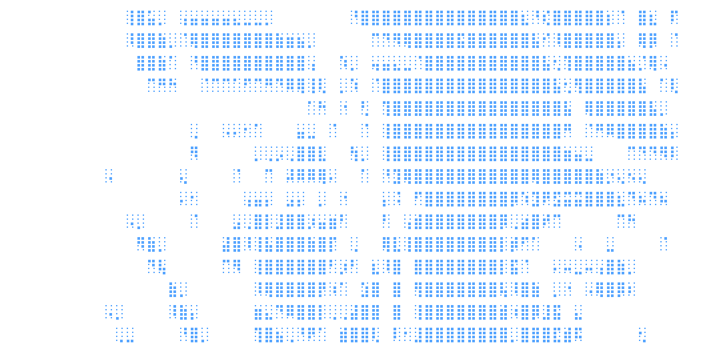

---

### Projects

| | Repo | Description |
|---|---|---|
| 📊 | [sales-frontend](https://github.com/Vangdale/sales-frontend) | Sales dashboard with DealsExplorer, filters & pagination |
| ⚙️ | [sales-backend](https://github.com/Vangdale/sales-backend) | Backend services powering the sales engine |
| ⚙️ | [manga-to-kindle](https://github.com/Vangdale/manga-to-kindle) | Desktop app to convert online mangas into a kindle format |

---

---

